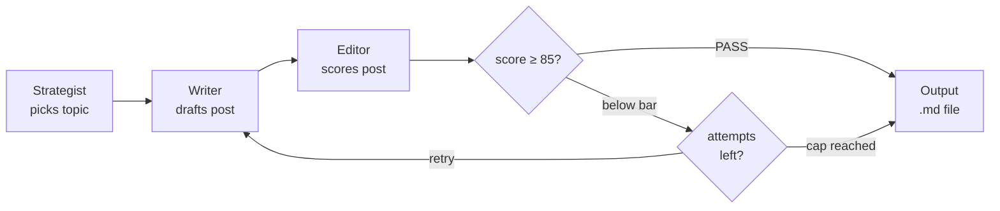

# crewai-factory


A configurable multi-agent content generation framework. Three AI agents — **strategist**, **writer**, and **editor** — collaborate in a **retry-until-pass flow** to produce publish-ready social media posts, driven entirely by YAML persona files.



*Diamonds are code-level decisions (no LLM); boxes are agent steps.*

## Why this exists

Most "AI content" tools are black boxes. This project treats content generation as an **engineering problem**: the persona, voice, quality bar, and language are all declarative configuration. The multi-agent architecture separates concerns — strategy, writing, and quality control are independent, testable, and swappable.

## Key design decisions

- **YAML-driven personas** — switch content domains (tech, cooking, travel) by changing one file, not code
- **Pydantic-validated config** — every setting is type-checked at startup via `pydantic-settings`
- **Ollama backend** — can run fully local (no API keys, no rate limits), or call Ollama cloud models through the same interface
- **Docker-first** — multi-stage build with `uv` for fast, reproducible environments
- **Structured logging** — `loguru` replaces print statements throughout

## Quick start

### Prerequisites

- Python 3.12 and [uv](https://github.com/astral-sh/uv)
- A running [Ollama](https://ollama.com) instance with at least one model pulled

### Run locally

```bash
git clone https://github.com/stansuo/crewai-factory.git
cd crewai-factory

cp .env.example .env        # set OLLAMA_MODEL to a model you have pulled
                            # (the default expects an Ollama cloud model)
uv sync                     # install dependencies

make demo                   # run with the default tech-blogger persona
```

### Run with Docker

```bash
docker compose run --rm crewai-factory
```

### Switch personas

```bash
# List available personas
python -m crewai_factory --list-personas

# Run with a different persona
python -m crewai_factory --persona personas/cooking-creator.yaml
```

## Project structure

```
crewai-factory/
├── src/crewai_factory/
│   ├── __init__.py          # Public API exports
│   ├── __main__.py          # CLI entrypoint
│   ├── config.py            # pydantic-settings configuration
│   ├── persona.py           # YAML persona loader + schema
│   ├── agents.py            # CrewAI agent construction
│   ├── tasks.py             # Task pipeline definition
│   ├── crew.py              # Orchestrator (wire + execute + save)
│   └── output.py            # File output with collision-safe naming
├── personas/
│   ├── tech-blogger.yaml    # English tech commentary
│   ├── cooking-creator.yaml # English home cooking
│   └── travel-storyteller.yaml  # zh-TW urban exploration
├── scripts/spikes/          # One-off exploratory scripts (not covered by CI)
├── tests/                   # pytest suite
├── .github/workflows/ci.yml # Lint + typecheck + test on every push
├── Dockerfile               # Multi-stage build (uv + python:3.12-slim)
├── docker-compose.yml
├── Makefile                 # Convenience targets (run, demo, test, lint)
└── pyproject.toml           # uv project definition + tool configs
```

## Creating a persona

A persona is a single YAML file that configures the entire pipeline:

```yaml
name: "Your Persona Name"
platform: "X (Twitter)"
language: "en"
max_length: 280

voice:
  tone: "your desired tone"
  perspective: "first-person"
  identity: |
    A paragraph describing who this persona is,
    what they care about, and how they see the world.

strategist:
  goal: "What the strategist should produce"
  backstory: "The strategist's detailed instructions"

writer:
  goal: "What the writer should produce"
  backstory: "The writer's detailed instructions"

editor:
  goal: "What the editor should enforce"
  backstory: "The editor's detailed scoring criteria"
```

Drop the file in `personas/` and pass `--persona personas/your-file.yaml`. No code changes needed.

## Development

```bash
make test         # run pytest
make lint         # ruff check + format
make typecheck    # mypy strict mode
make ci           # all three in sequence
```

## Tech stack

| Layer | Tool |
|---|---|
| Language | Python 3.12 |
| AI framework | CrewAI 1.14+ |
| LLM backend | Ollama (local inference) |
| Config | pydantic-settings |
| Persona schema | Pydantic + PyYAML |
| Logging | loguru |
| Package manager | uv |
| Container | Docker (multi-stage) + Docker Compose |
| CI | GitHub Actions (ruff, mypy, pytest) |

## Roadmap

See [docs/ROADMAP.md](docs/ROADMAP.md) for the full milestone plan. Current status:

| Milestone | Description | Status |
|---|---|---|
| M1 | Foundation fixes (Python 3.12, base setup) | ✅ |
| M2 | Modular package + engineering foundation (tests, CI, linting) | ✅ |
| M3 | Upgrade to CrewAI Flow (retry-until-pass) | ✅ |
| M4 | X API integration + deployment | 📋 |
| M5+ | Performance tracking & BI dashboard, prompt iteration, image generation | 📋 |

## License

MIT
